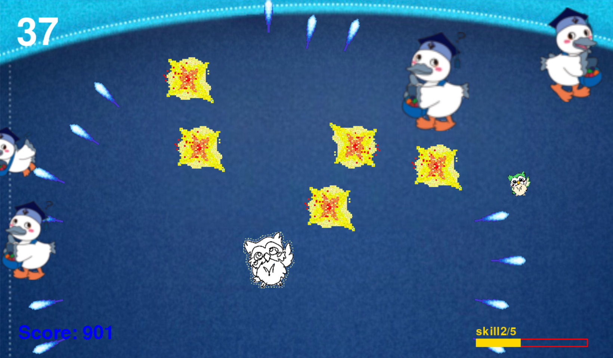

# 詰む積む

## 実行環境の必要条件
* python >= 3.10
* pygame >= 2.1

## ゲームの概要
* めい〇じろう（主人公）がこうかとんをぼこぼこにする
* 1分間でスコアを稼ぐ
* 時間増減仕様を作る
* 倒す敵によってスコア加算が変わる
* スキル発動あり

## ゲームの遊び方
* enterキーを押してゲームスタート
* spaceキーを押して攻撃する
* ➝キーで上下左右操作
* 緑のめじろうを撃ったら３秒増える
* 青いめじろうを撃つことで５秒減る
* スキルゲージが5溜まったらenterキーを押してスキル
* こうかとんの大きさによってスコアが変わる
* こうかとんに当たったら終了
* カウントが0になったっら終了
* スコアが表示される

## ゲームの実装
### 共通基本機能
* 背景画像と主人公キャラクターの描画
* 敵こうかとん描画

### 分担追加機能
* 爆弾こうかとんが降ってくる/クラス名→Bomb(maruno)
* スキル機能：スキルゲージと拡散ビーム/クラス名→Skill(matsumoto)
* タイムボム機能/クラス名→TimeBird(kuzawa)
* スタート・スコア表示画面/クラス名→Start(urata)

### ToDo
- [ ] ゲーム終盤に連れて落ちてくるこうかとん数や爆弾こうかとんの数の増加機能
- [ ] ライフが増えたりする機能

### メモ
* コメントをできる限り付ける(実装内容を分かりやすく) 
